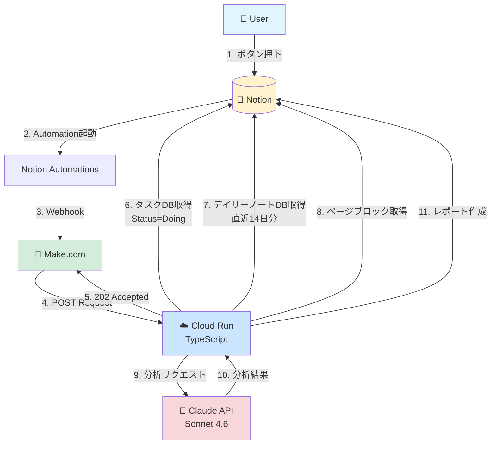
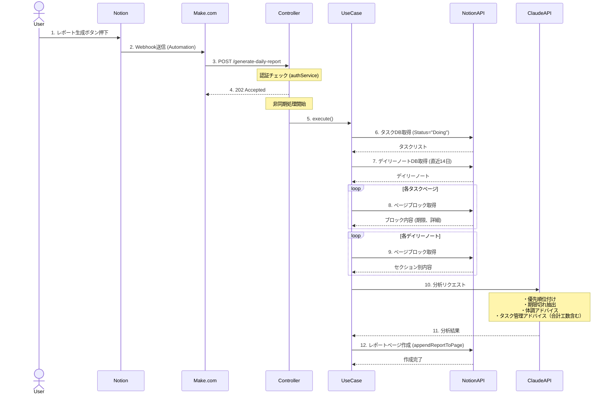
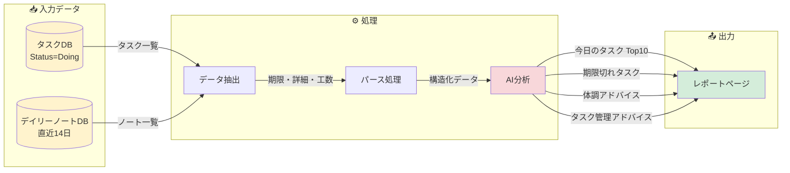
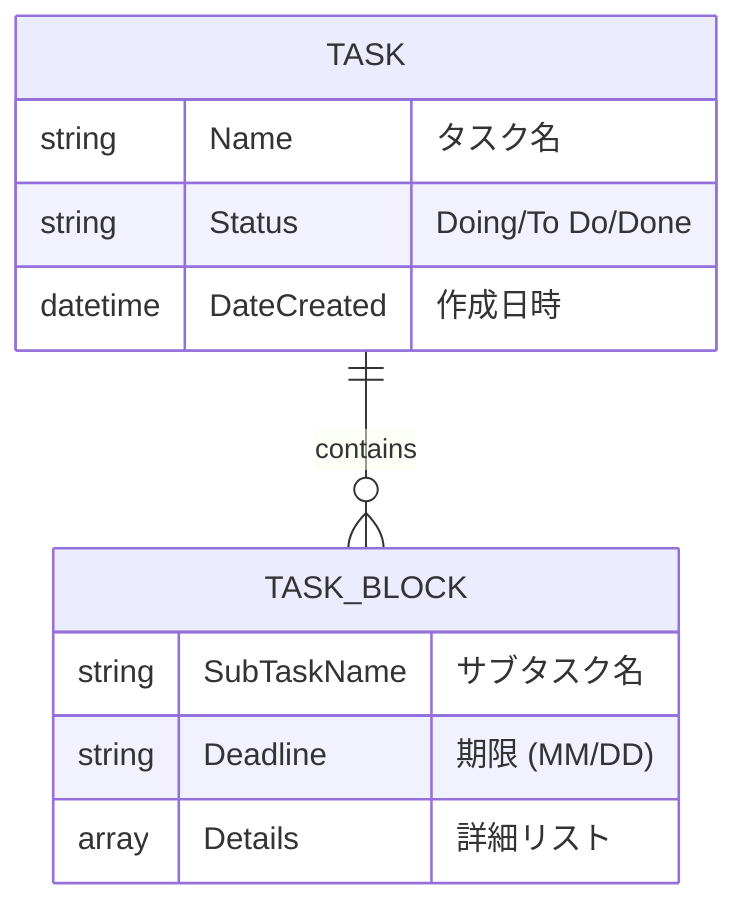
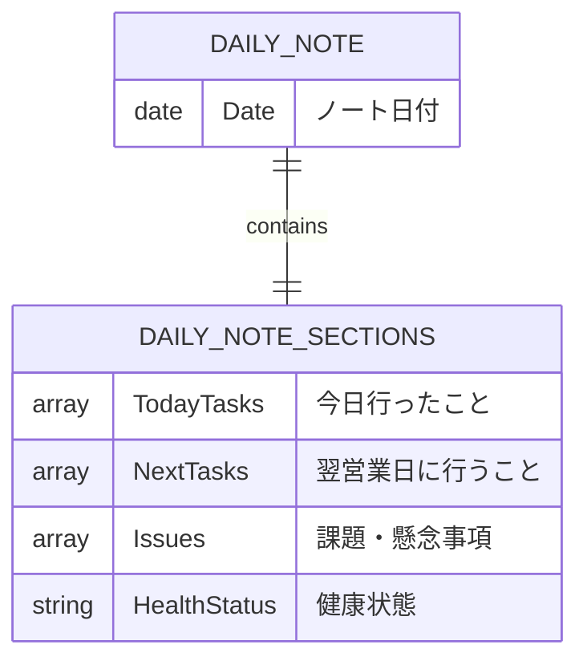
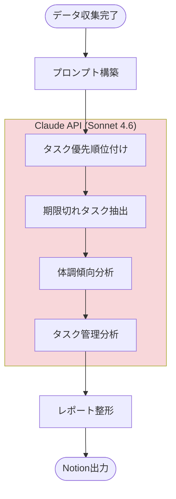
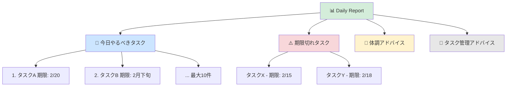

# Architecture - Notion Daily Report System

**作成日**: 2026-02-23
**対象**: Notion Daily Report 自動生成システム

---

## 1. システムアーキテクチャ

### 1.1 コンポーネント構成

### 1.2 技術スタック

| レイヤー | 技術 | 役割 |
|---------|------|------|
| **UI** | Notion | ボタントリガー、データソース、レポート出力 |
| **Orchestration** | Make.com | Cloud Run呼び出し |
| **Backend** | Cloud Run (TypeScript) | データ解析、AI連携、レポート生成 |
| **AI** | Claude API (Sonnet 4.6) | タスク優先順位付け、アドバイス生成 |

---

## 2. 処理フロー

### 2.1 シーケンス図

### 2.2 データフロー

---

## 3. データモデル

### 3.1 タスクDB構造

**取得条件**: `Status = "Doing"`

**ブロック抽出パターン**:
- 期限: `期限：MM/DD` または `期限：〇月下旬`
- 詳細: 「詳細」セクション配下の箇条書き

### 3.2 デイリーノートDB構造

**取得条件**: `日付 >= (今日 - 14日)`

**セクション構造**:
- 【今日行ったこと】: タスク + 工数 (例: `予約登録APIの開発（4.5H）`)
- 【翌営業日に行うこと】: 計画タスク
- 【課題・懸念事項】: 管理上の課題
- 【健康状態】: 体調記述

---

## 4. AI分析処理

### 4.1 Claude API 処理フロー

### 4.2 分析アルゴリズム

**優先順位判定基準** (Claude AIが総合判断):
1. 期限が今日または過去のタスク → 最優先
2. デイリーノート「翌営業日に行うこと」記載タスク → 高優先
3. 工数が大きいタスク → 計画的に着手
4. 期限が「○月下旬」などの曖昧な表現 → 文脈から判断

**体調アドバイス観点**:
- 直近14日間の健康状態推移
- 悪化傾向の検出
- 改善提案 (100-200文字)

**タスク管理アドバイス観点**:
- 1日の合計工数が過多 → 負荷分散提案
- 特定タスクが長期化 → 効率化提案
- 期限切れタスク多数 → 見積もり改善提案

---

## 5. レポート生成

### 5.1 出力構造

### 5.2 レポートページ仕様

**ページタイトル**: `📊 Daily Report - YYYY/MM/DD`

**セクション**:
1. **🎯 今日やるべきタスク** (最大10件)
   - タスク名、期限、選定理由
2. **⚠️ 期限切れタスク** (該当する全て)
   - タスク名、期限
3. **💪 体調アドバイス** (100-200文字)
   - Claude生成のアドバイス
4. **📝 タスク管理アドバイス** (100-200文字)
   - Claude生成のアドバイス

**フッター**: 生成日時

---
