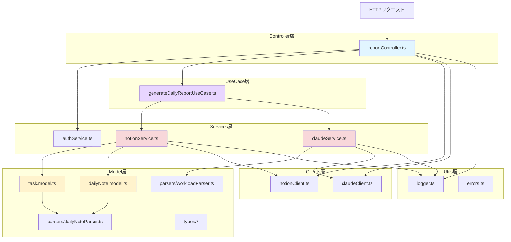
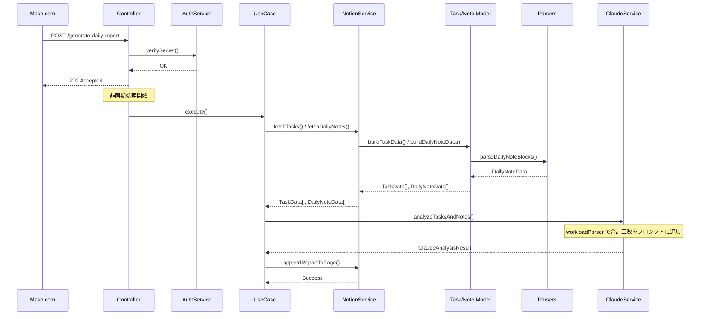

# プロジェクトディレクトリ構成

**作成日**: 2026-02-24
**更新日**: 2026-03-16
**プロジェクト**: Notion Daily Report 自動生成システム

---

## ディレクトリツリー

```
task-analyzer/
├── docs/                               # 📚 ドキュメント
│
├── src/                                # 💻 ソースコード
│   ├── controllers/                    # 【Controller層】HTTPリクエスト処理
│   │
│   ├── usecases/                       # 【UseCase層】ビジネスフロー制御
│   │
│   ├── models/                         # 【Model層】データモデル、ビジネスロジック
│   │   ├── types/                      # 型定義
│   │   └── parsers/                    # ブロック解析ロジック
│   │
│   ├── services/                       # 【Services層】外部API通信
│   ├── clients/                        # 【Clients層】APIクライアント初期化
│   ├── utils/                          # ユーティリティ
│   ├── config/                         # 設定
│   └── tests/                          # 🧪 テスト
│       ├── unit/                       # ユニットテスト
│       │   ├── models/
│       │   │   └── parsers/
│       │   ├── services/
│       │   ├── usecases/
│       │   └── utils/
│       └── integration/                # 統合テスト
```

---

## アーキテクチャ概要図



---

## 各ディレクトリの役割

### 📁 `src/controllers/` - Controller層

**役割**: HTTPリクエスト処理、認証、フロー制御

- `reportController.ts`: POST /generate-daily-report エンドポイント
  - リクエスト受け取り → 認証 → 202 Accepted返却
  - 非同期でUseCase を起動
  - エラーハンドリング・ロギング

---

### 📁 `src/usecases/` - UseCase層

**役割**: ビジネスフローの制御（Controller と Services の中間層）

- `generateDailyReportUseCase.ts`: エンドツーエンドの処理フロー
  - タスクDB取得 → デイリーノート取得 → Claude分析 → レポート出力

---

### 📁 `src/models/` - Model層

**役割**: データモデル定義、ビジネスロジック、データ変換

#### `models/types/` - 型定義
- Notion API形式と内部形式を明確に分離
- NotionTask/NotionDailyNote（外部形式）
- TaskData/DailyNoteData（内部形式）
- ClaudeAnalysisResult（AI分析結果）

#### `models/parsers/` - 解析ロジック
- **dailyNoteParser**: デイリーノートブロックを解析してセクション別に分類（【今日行ったこと】等）
- **workloadParser**: 工数を抽出・集計（`"発表準備（3H）"` → `3`）

#### `models/*.model.ts` - モデルロジック
- **task.model**: NotionTask → TaskData変換（期限抽出を含む）
- **dailyNote.model**: NotionDailyNote → DailyNoteData変換

---

### 📁 `src/services/` - Services層

**役割**: 外部API（Notion, Claude）との通信、レポート生成

- **notionService**: Notion API操作
  - タスク・デイリーノートのDB取得
  - ブロック取得
  - レポートページへのブロック追記（`appendReportToPage`）

- **claudeService**: Claude API呼び出し
  - モデル: claude-sonnet-4-6
  - max_tokens: 2000
  - プロンプト構築（合計工数を含む）

- **authService**: 認証チェック
  - SECRET_TOKENとの照合

---

### 📁 `src/clients/` - Clients層

**役割**: 外部APIクライアントの初期化・保持

- **notionClient**: Notion SDK `Client` をラップ。`inner` プロパティでSDKインスタンスを公開
- **claudeClient**: Anthropic SDK `Anthropic` をラップ。`inner` プロパティでSDKインスタンスを公開

Controller でリクエストごとに1インスタンスを生成し、UseCase・Service に注入する。

---

### 📁 `src/utils/` - ユーティリティ

- **logger**: [INFO]/[WARN]/[ERROR]ログ出力（Cloud Logging）
- **errors**: カスタムエラークラス
  - AuthenticationError（401）
  - NotionAPIError
  - ClaudeAPIError
  - BlockFetchError
- **cryptoApiKey**: 認証キーの暗号化比較

---

### 📁 `src/config/` - 設定

- **environment**: 環境変数取得・検証
  - SECRET_TOKEN（認証用）
  - ANTHROPIC_API_KEY（Claude API）
  - NOTION_TOKEN（Notion Integration Token）

---

### 📁 `src/tests/` - テスト

- **unit/**: ユニットテスト（各モジュールを個別にテスト）
- **integration/**: 統合テスト（エンドツーエンドのフロー）

---

## データフロー



---

## レイヤー間の依存関係

```
┌─────────────────────────────────────────┐
│         Controller層                    │
│  (HTTPリクエスト処理、フロー制御)        │
└─────────────┬───────────────────────────┘
              │
              ▼
┌─────────────────────────────────────────┐
│         UseCase層                       │
│  (ビジネスフロー制御)                   │
└─────────────┬───────────────────────────┘
              │
    ┌─────────┼─────────┐
    ▼         ▼         ▼
┌────────┐ ┌────────┐ ┌────────┐
│ Model層│ │Services│ │ Utils  │
│        │ │   層   │ │   層   │
└────┬───┘ └───┬────┘ └────────┘
     │         │
     └─────────┘
          │
    ┌─────┴─────┐
    ▼           ▼
┌────────┐  ┌────────┐
│ Notion │  │ Claude │
│  API   │  │  API   │
└────────┘  └────────┘
```

**依存の方向**:
- Controller → UseCase/Services/Clients/Utils
- UseCase → Services/Clients/Utils
- Model → Services/Utils/Parsers
- Services → Clients/Utils/Model
- Clients → 外部SDK（初期化のみ）

**原則**:
- 上位層から下位層への依存のみ許可
- 同一層内での依存は最小限に
- 循環依存は禁止
