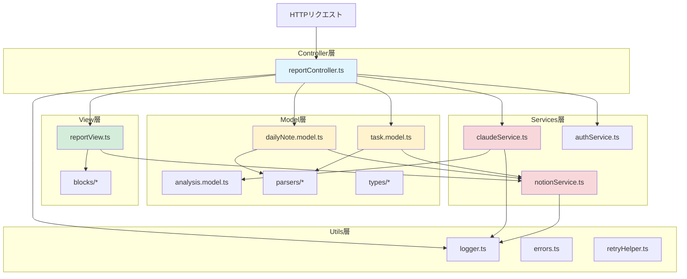
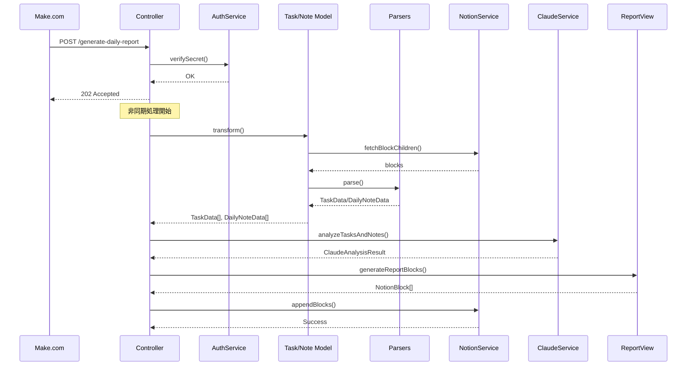

# プロジェクトディレクトリ構成

**作成日**: 2026-02-24
**プロジェクト**: Notion Daily Report 自動生成システム

---

## ディレクトリツリー

```
task-analyzer/
├── docs/                               # 📚 ドキュメント
│
├── src/                                # 💻 ソースコード
│   ├── controllers/                    # 【Controller層】HTTPリクエスト処理
│   │
│   ├── models/                         # 【Model層】データモデル、ビジネスロジック
│   │   ├── types/                      # 型定義
│   │   └── parsers/                    # ブロック解析ロジック
│   │
│   ├── views/                          # 【View層】Notionページ生成
│   │   ├── blocks/                     # Notionブロック生成ヘルパー
│   │   └── types/                      # Notionブロック型定義
│   │
│   ├── services/                       # 【Services層】外部API通信
│   ├── middleware/                     # ミドルウェア
│   ├── utils/                          # ユーティリティ
│   └── config/                         # 設定
│
└── tests/                              # 🧪 テスト
    ├── unit/                           # ユニットテスト
    │   ├── models/
    │   │   └── parsers/
    │   ├── views/
    │   ├── services/
    │   └── utils/
    ├── integration/                    # 統合テスト
    └── fixtures/                       # テストデータ
```

---

## MVCアーキテクチャ概要図



---

## 各ディレクトリの役割

### 📁 `src/controllers/` - Controller層

**役割**: HTTPリクエスト処理、認証、フロー制御

- `reportController.ts`: POST /generate-daily-report エンドポイント
  - リクエスト受け取り → 認証 → 202 Accepted返却
  - 非同期処理でModel/Services/Viewを調整
  - エラーハンドリング・ロギング

---

### 📁 `src/models/` - Model層

**役割**: データモデル定義、ビジネスロジック、データ変換

#### `models/types/` - 型定義
- Notion API形式と内部形式を明確に分離
- NotionTask/NotionDailyNote（外部形式）
- TaskData/DailyNoteData（内部形式）
- ClaudeAnalysisResult（AI分析結果）

#### `models/parsers/` - 解析ロジック
- **deadlineParser**: 期限文字列を解析（"2/20" → Date型）
- **workloadParser**: 工数を抽出（"（3H）" → 3）
- **sectionParser**: セクションを分割（【今日行ったこと】等）

#### `models/*.model.ts` - モデルロジック
- **task.model**: NotionTask → TaskData変換
- **dailyNote.model**: NotionDailyNote → DailyNoteData変換
- **analysis.model**: Claude分析結果の検証

---

### 📁 `src/views/` - View層

**役割**: Notionページ生成（ブロック構造の組み立て）

#### `views/blocks/` - ブロック生成ヘルパー
- 各ブロックタイプのヘルパー関数（純粋関数）
- heading1/heading2, numberedListItem, bulletedListItem, divider, paragraph

#### `views/reportView.ts` - レポート生成
- ClaudeAnalysisResult → NotionBlock[]への変換
- レポート全体の構造組み立て
- タイムスタンプ生成（YYYY/MM/DD HH:MM）

---

### 📁 `src/services/` - Services層

**役割**: 外部API（Notion, Claude）との通信

- **notionService**: Notion API操作
  - ブロック取得（3回リトライ）
  - ブロック追加（2回リトライ）
  - エラーレポート作成

- **claudeService**: Claude API呼び出し
  - モデル: claude-sonnet-4-6-20260217
  - max_tokens: 2000
  - リトライなし（コスト考慮）

- **authService**: 認証チェック
  - SECRET_TOKENとの照合

---

### 📁 `src/middleware/` - ミドルウェア

- **errorHandler**: グローバルエラーキャッチ、エラーログ出力
- **asyncHandler**: 非同期処理のtry-catchを統一

---

### 📁 `src/utils/` - ユーティリティ

- **logger**: [INFO]/[WARN]/[ERROR]ログ出力（Cloud Logging）
- **errors**: カスタムエラークラス
  - AuthenticationError（401）
  - NotionAPIError
  - ClaudeAPIError
  - BlockFetchError
- **retryHelper**: exponential backoffリトライロジック
- **validators**: リクエストバリデーション

---

### 📁 `src/config/` - 設定

- **environment**: 環境変数取得・検証
  - SECRET_TOKEN（認証用）
  - ANTHROPIC_API_KEY（Claude API）
  - NOTION_TOKEN（Notion Integration Token）

---

### 📁 `tests/` - テスト

- **unit/**: ユニットテスト（各モジュールを個別にテスト）
- **integration/**: 統合テスト（エンドツーエンドのフロー）
- **fixtures/**: テストデータ（JSON形式のサンプルデータ）

---

## データフロー



---

## レイヤー間の依存関係

```
┌─────────────────────────────────────────┐
│         Controller層                    │
│  (HTTPリクエスト処理、フロー制御)        │
└─────────────┬───────────────────────────┘
              │
    ┌─────────┼─────────┬─────────┐
    ▼         ▼         ▼         ▼
┌────────┐ ┌────────┐ ┌────────┐ ┌────────┐
│ Model層│ │ View層 │ │Services│ │ Utils  │
│        │ │        │ │   層   │ │   層   │
└────┬───┘ └───┬────┘ └───┬────┘ └────────┘
     │         │           │
     └─────────┴───────────┘
               │
         ┌─────┴─────┐
         ▼           ▼
    ┌────────┐  ┌────────┐
    │ Notion │  │ Claude │
    │  API   │  │  API   │
    └────────┘  └────────┘
```

**依存の方向**:
- Controller → Model/View/Services/Utils
- Model → Services/Utils/Parsers
- View → Services/Utils/Blocks
- Services → Utils

**原則**:
- 上位層から下位層への依存のみ許可
- 同一層内での依存は最小限に
- 循環依存は禁止
